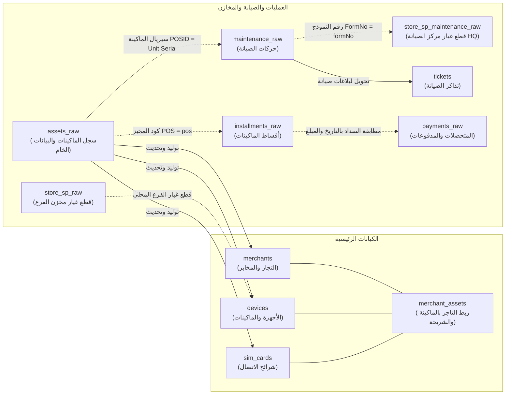

# دليل وهيكلية قاعدة بيانات نظام SmartCS (العلاقات والاستخدامات) 📚

نظام **SmartCS** يعتمد على معمارية بيانات مزدوجة ومتكاملة تجمع بين استيعاب الجداول الخام المتزامنة لحظياً من ملف مايكروسوفت آكسيس (`Bread_Final_be.accdb`)، وبين الجداول المعيارية المهيكلة لتسريع الاستعلامات وعمليات لوحة التحكم والذكاء الاصطناعي (AI Copilot).

---

## 🏛️ طبقات قاعدة البيانات (Architectural Layers)

1. **الطبقة الخام المتزامنة (`_raw Tables`)**:
   - مرآة طبق الأصل من جداول ميكروسوفت آكسيس.
   - يتم تحديثها تلقائياً عبر محرك المزامنة اللحظي (`sync_engine.js`) فور تعديل أي سجل في قاعدة بيانات آكسيس.
   - تُستخدم كأساس لبيانات الصيانة التاريخية، والمخازن، والأصول، والمقبوضات.

2. **طبقة النطاق والتشغيل المعياري (Normalized Domain Entities)**:
   - جداول مهيكلة ونظيفة تُستنتج تلقائياً وتُحدث عبر وظيفة `syncHighLevelDomainEntities`.
   - تُنشئ علاقات صريحة ومفهرسة بين: التاجر (`merchants`)، الماكينة (`devices`)، الشريحة (`sim_cards`)، والأصول المربوطة (`merchant_assets`).
   - تدعم التذاكر (`tickets`) وحركات الصرف الدقيقة ومستويات المخزون الحرجة.

3. **طبقة المزامنة والمراقبة (Sync & Telemetry Layer)**:
   - مسؤولة عن تتبع التغييرات بالثانية (`audit_change_logs`).
   - إدارة طوابير الدفع للسيرفر السحابي (`delta_outbox`).
   - سجلات الأخطاء ومراقبة صحة النظام (`system_error_logs`).

---

## 📊 الفهرس التفصيلي لجميع الجداول (Detailed Table Directory)

### أولاً: جداول آكسيس الخام (Access Raw Replicas)

| اسم الجدول | الوصف والدور في النظام | أهم الأعمدة والمفاتيح | شاشات واستخدامات البرنامج | العلاقات والروابط مع الجداول الأخرى |
|---|---|---|---|---|
| **`assets_raw`** | السجل الرئيسي الشامل لكافة ماكينات المخابز، التجار، المحافظات، ومكاتب التموين المسجلة بالسيستم. | `ID` (المعرف العام)<br>`POS` (كود المخبز/الماكينة)<br>`POSID` (سيريال الماكينة)<br>`Model` (الموديل)<br>`GrocerNumber` (رقم التاجر)<br>`Contact_person` (اسم التاجر)<br>`Address` (المحافظة/العنوان)<br>`Cell_Serial` (سيريال الشريحة) | • شاشة البحث العام والاستعلامات.<br>• تقارير التوزيع الجغرافي للماكينات.<br>• بطاقة بيانات المخبز.<br>• محرك استعلامات الذكاء الاصطناعي. | • يرتبط مع `maintenance_raw` عبر سيريال الماكينة (`assets_raw.POSID` = `maintenance_raw."Unit Serial"`).<br>• يرتبط مع `transactions_raw` عبر (`assets_raw.POS` = `transactions_raw.POSN`).<br>• يرتبط مع `payments_raw` عبر (`assets_raw.POS` = `payments_raw.pos_number`).<br>• يرتبط مع `store_sim_raw` عبر (`assets_raw.Cell_Serial` = `store_sim_raw.sim_serial`).<br>• يرتبط مع `installments_raw` عبر (`assets_raw.POS` = `installments_raw.pos`). |
| **`maintenance_raw`** | سجل عمليات الصيانة، دخول وخروج الأجهزة، الأعطال المرصودة، وتكليف الفنيين بالإصلاح. | `ID` (رقم السجل)<br>`Unit Serial` (سيريال الماكينة)<br>`Model` (الموديل)<br>`Checked Out To` (اسم الفني المستلم)<br>`Checked Out Date` (تاريخ الخروج)<br>`Checked In Date` (تاريخ الدخول/الإصلاح)<br>`Notes` (وصف العطل الأساسي)<br>`Procedure` (الإجراء المنفذ)<br>`FormNo` (رقم نموذج الصيانة)<br>`spstatus` (حالة قطع الغيار) | • لوحة تحكم الصيانة العامة.<br>• تقارير أكثر الأعطال تكراراً.<br>• تقييم أداء الفنيين ومعدل الإنجاز.<br>• تتبع الأجهزة المعلقة والمعطلة. | • يرتبط مع `assets_raw` عبر سيريال الماكينة (`"Unit Serial"` = `POSID`).<br>• يرتبط مع `store_sp_maintenance_raw` عبر رقم نموذج الصيانة (`FormNo` = `formNo`).<br>• يرتبط مع `tblstaff_raw` عبر اسم الفني (`"Checked Out To"` = `name`).<br>• يرتبط مع `tblfaults_raw` عبر مسميات الأعطال في `Notes`. |
| **`store_sp_raw`** | مخزن قطع الغيار **المحلية في الفرع** (حركات التوريد الوارد والصرف المستهلك بالفرع). | `Serial` (سيريال القطعة)<br>`type` (نوع القطعة)<br>`Model` (الموديل المتوافق)<br>`count_in` (الوارد للفرع)<br>`count_out` (المنصرف بالفرع)<br>`in_date` (تاريخ الاستلام)<br>`out_date` (تاريخ الصرف) | • شاشة مخزن قطع غيار الفرع.<br>• حساب استهلاك الفرع المحلي اليومي والشهري.<br>• تنبيهات الأرصدة والنواقص. | • يمثل الوجه المحلي المقابل لمركز الصيانة.<br>• يرتبط مع `failure_points_raw` عبر (`type` = `type`) لمعرفة أسعار ورسوم القطع. |
| **`store_sp_maintenance_raw`** | مخزن قطع الغيار المنصرفة بعمليات الإصلاح في **مركز الصيانة الرئيسي (HQ)** بموجب نماذج الصيانة الرسمية. | `Serial` (سيريال الماكينة/القطعة)<br>`type` (اسم القطعة: بوردة، قارئ بطاقات، تروس، شاشة)<br>`count_out` (الكمية المنصرفة)<br>`out_date` (تاريخ ووقت الصرف)<br>`formNo` (رقم نموذج الصيانة)<br>`faulty_detils` (تفاصيل العطل والنموذج) | • لوحة مخزن الصيانة الرئيسي (HQ Maintenance).<br>• حساب إجمالي القطع المستهلكة في العمرات والإصلاحات المركزية.<br>• مطابقة نماذج الصيانة مع القطع. | • يرتبط بشكل وثيق مع `maintenance_raw` عبر رقم النموذج (`formNo` = `FormNo`) وسيريال الماكينة (`Serial` = `"Unit Serial"`).<br>• يرتبط مع `failure_points_raw` لحساب التكلفة. |
| **`payments_raw`** | سجل المقبوضات والتوريدات المالية (مكاتب البريد، بنك مصر، خزينة، فروع، ضامن). | `ID` (معرف الإيصال)<br>`payment_amount` (المبلغ بالجنيه)<br>`payment_date` (تاريخ التوريد)<br>`payer` (اسم المورد/التاجر)<br>`payment_reason` (سبب التوريد: صيانة، قسط، شريحة...)<br>`ref_num` (رقم العملية/الإيصال)<br>`pos_number` (كود أو سيريال الماكينة)<br>`payment_place` (جهة التوريد) | • شاشة المتحصلات والتدقيق المالي.<br>• متابعة سداد تكاليف الصيانة.<br>• مطابقة أقساط الماكينات المسددة.<br>• تقارير التوريدات البريدية والبنكية. | • يرتبط مع `assets_raw` عبر (`pos_number` = `POS` أو سيريال الماكينة).<br>• يرتبط مع `installments_raw` لمطابقة مبالغ الأقساط الشهرية.<br>• يرتبط مع `tickets` عبر رقم الإيصال (`ref_num`). |
| **`installments_raw`** / **`tblinstallments`** | عقود التقسيط المبرمة للماكينات، عدد الأقساط، سعر الوحدة، القسط الشهري، وإجمالي السعر. | `id` (معرف العقد)<br>`pos` (كود المخبز/الماكينة)<br>`installments` (عدد الأقساط الإجمالي)<br>`unitprice` (سعر الوحدة)<br>`monthlyinstallmentprice` (قيمة القسط الشهري)<br>`finalunitprice` (السعر الإجمالي النهائي) | • لوحة متابعة الأقساط (Installments Dashboard).<br>• حساب المتأخرات والمبالغ المتبقية للتحصيل.<br>• تتبع العقود المكتملة والسارية. | • يرتبط مع `assets_raw` عبر كود الماكينة (`pos` = `POS`).<br>• يرتبط مع `payments_raw` لحساب الأقساط المسددة (حيث `payment_reason` يحتوي على "قسط"). |
| **`store_pos_raw`** | مخزون ماكينات نقاط البيع (POS) المتواجدة فعلياً في المخزن المحلي. | `Serial` (سيريال الجهاز)<br>`type` (الشركة المصنعة: PAX, Verifone...)<br>`Model` (الموديل: S90, D230, VX520...)<br>`faulty` (معطل أم سليم)<br>`pos_status` (الحالة: متاح، محجوز، صيانة، كهنة) | • شاشة مخزن الماكينات (Warehouse POS).<br>• جرد الأجهزة الجاهزة للصرف والتسليم الفوري.<br>• عزل الأجهزة المعطلة المطلوب إرسالها للصيانة. | • يرتبط مع `assets_raw` عبر السيريال (`Serial` = `POSID`).<br>• يرتبط مع `temp_transfer_raw` عند تسليم ماكينة كبديل مؤقت. |
| **`store_sim_raw`** | مخزن شرائح الاتصال المتواجدة بالفرع وحالتها التشغيلية والشبكة التابعة لها. | `sim_serial` (سيريال الشريحة)<br>`network` (الشبكة: فودافون، أورنج، اتصالات، وي)<br>`sim_type` (نوع الشريحة)<br>`faulty` (سليمة أم تالفة) | • شاشة مخزن الشرائح (SIM Warehouse).<br>• جرد الأرصدة المتاحة من كل شبكة.<br>• إدارة الشرائح التالفة والمستبدلة. | • يرتبط مع `assets_raw` عبر (`sim_serial` = `Cell_Serial`).<br>• يرتبط مع `merchants` عند تخصيص شريحة للتاجر. |
| **`transactions_raw`** | سجل الإجراءات الميدانية والحركات الإدارية والرسوم المقررة. | `ID` (معرف الحركة)<br>`GrocerName` (اسم المخبز/التاجر)<br>`POSN` (كود الماكينة)<br>`Place` (المحافظة/الإدارة)<br>`ActionType` (نوع الإجراء: تركيب، استبدال، سحب، فحص)<br>`ActionDate` (تاريخ الإجراء)<br>`FeesAmount` (الرسوم المقررة)<br>`Procedure` (المسؤول عن التنفيذ) | • شاشة سجل حركات التجار والمخابز.<br>• التدقيق الإداري والميداني.<br>• متابعة الرسوم والتسويات. | • يرتبط مع `assets_raw` عبر (`POSN` = `POS`).<br>• يرتبط مع `tblstaff_raw` عبر اسم الموظف المنفذ (`Procedure`). |
| **`temp_transfer_raw`** / **`temp_transfer`** | حركات نقل واستبدال الماكينات المؤقتة أثناء فترة صيانة الماكينة الأصلية. | `POSCode` (كود الماكينة)<br>`OldPOS` (سيريال الماكينة المستلمة للصيانة)<br>`NewPOS` (سيريال الماكينة البديلة المسلمة للعميل)<br>`Transfer_Date` (تاريخ الاستبدال)<br>`bkCode` (كود المخبز) | • تتبع الأجهزة البديلة في الميدان لمنع الفقدان.<br>• تسهيل استرجاع الجهاز البديل بعد انتهاء إصلاح الجهاز الأصلي. | • يرتبط مع `assets_raw` و `store_pos_raw` عبر السيريال القديم والجديد (`OldPOS`, `NewPOS`).<br>• يرتبط مع `merchants` عبر `bkCode`. |
| **`failure_points_raw`** | اللائحة المعتمدة لتسعير قطع الغيار ونقاط الصيانة وتكلفة الإصلاح حسب الموديل. | `type` (اسم القطعة)<br>`model` (موديل الجهاز المتوافق)<br>`fees` (رسوم الصيانة المصنعية)<br>`price` (سعر بيع القطعة للعميل) | • التسعير الفوري لفواتير الصيانة.<br>• حساب الإيرادات المتوقعة للصيانة. | • يرتبط مع `store_sp_raw` و `store_sp_maintenance_raw` عبر (`type` + `model`). |
| **`failure_points_price_history`** | الأرشيف التاريخي لتعديلات وتحديثات أسعار قطع الغيار ومصدر التعديل. | `part_name`, `model`, `old_price`, `new_price`, `change_date`, `effective_from`, `change_source` | • التتبع المالي والتاريخي لتكلفة قطع الغيار.<br>• التدقيق والرقابة على تعديل الأسعار. | • يرتبط مع `failure_points_raw` عبر (`part_name` = `type`). |
| **`tblfaults_raw`** / **`tblfaults`** | قاموس مسميات الأعطال القياسي في النظام (شاشة، طابعة، قارئ كروت، بوردة...). | `faultid` / `id` (كود العطل)<br>`FaultName` / `fault_name` (اسم العطل بالعربي) | • توحيد مسميات الأعطال في شاشات الصيانة والتذاكر.<br>• توجيه الذكاء الاصطناعي لفهم أسئلة الأعطال. | • يرتبط مع `tblfixes_raw` عبر كود العطل (`faultid` = `FaultID`).<br>• يرتبط مع `maintenance_raw` في تصنيف الأعطال. |
| **`tblfixes_raw`** | دليل الإصلاحات والإجراءات الفنية المقترحة لكل نوع عطل. | `FixID` (معرف الإصلاح)<br>`FaultID` (كود العطل التابع له)<br>`FixName` (الإجراء الفني: استبدال بوردة، لحام سوكت، تنظيف تروس...) | • مساعدة الفنيين باقتراح الحلول والإصلاحات المعتمدة.<br>• توثيق خطوات الحل في بلاغات الصيانة. | • يرتبط مع `tblfaults_raw` عبر (`FaultID` = `faultid`). |
| **`tblstaff_raw`** / **`tblstaff`** | دليل موظفي الشركة، فنيي الصيانة، المسميات الوظيفية ومستويات الصلاحيات. | `id` (معرف الموظف)<br>`name` (اسم الموظف/الفني)<br>`jtitle` / `role` (المسمى الوظيفي)<br>`can_maintain` (صلاحية مباشرة الصيانة) | • تسجيل الدخول وإدارة الجلسات والصلاحيات.<br>• إسناد التذاكر وتوزيع أعباء العمل على الفنيين.<br>• تقارير إنتاجية فنيي الصيانة. | • يرتبط مع `maintenance_raw` عبر (`name` = `Checked Out To` أو `Procedure`).<br>• يرتبط مع `tickets` عبر `technician_name`. |
| **`trade_raw`** | سجل حركات التداول والتسليم والتسلم العامة للمهمات والمعدات بين الفروع. | `ID`, `Item Serial`, `Item Type`, `Trade Type`, `Trade Location`, `Out Date`, `In Date`, `Quantity`, `Form Number` | • مراقبة النقل الداخلي للمهمات والماكينات بين المواقع. | • يرتبط مع المخازن وسجلات التوريد عبر (`Item Serial`, `Form Number`). |

---

### ثانياً: طبقة الكيانات المعيارية (Normalized Domain Entities)

| اسم الجدول | الوصف والدور في النظام | أهم الأعمدة | العلاقات المفتاحية |
|---|---|---|---|
| **`merchants`** | الكيان الموحد للتجار وأصحاب المخابز المسجلين. | `merchant_code` (المفتاح الأساسي)<br>`name`, `type`, `contact_phone`, `address`, `government`, `national_id` | المرجع المركزي الذي ترتبط به الأصول (`merchant_assets`) والتذاكر (`tickets`) والمدفوعات (`payments`). |
| **`devices`** | الكيان المعياري للماكينات، مواصفاتها، حالتها الهندسية ونقاط اللحام. | `serial` (المفتاح الأساسي)<br>`manufacturer`, `model`, `status`, `faulty_details`, `solder_bridges` | يرتبط مع التاجر عبر `merchant_assets` ومع تذاكر الصيانة عبر `tickets.device_id`. |
| **`sim_cards`** | الكيان المعياري لشرائح الاتصال. | `serial` (المفتاح الأساسي)<br>`carrier`, `status` | يرتبط مع التاجر والماكينة عبر `merchant_assets`. |
| **`merchant_assets`** | **جدول الربط المحوري الثلاثي** (يربط التاجر بالماكينة بالشريحة). | `id`, `merchant_code`, `device_id`, `sim_card_id`, `assigned_date` | يجمع بين (`merchants.merchant_code`) و (`devices.serial`) و (`sim_cards.serial`). |
| **`tickets`** | سجل تذاكر وبلاغات الصيانة المتكامل في لوحة التحكم. | `id`, `merchant_code`, `device_id`, `status`, `issue_details`, `technician_name`, `issue_date`, `close_date`, `hq_debt` | يربط المخبز بالجهاز المعطل بالفني القائم بالإصلاح ومتابعة مديونية الصيانة. |
| **`spare_parts`** | الدليل التجميعي المحدث لقطع الغيار وأرصدة المخزون وحدود الطلب الحرجة. | `id`, `part_name`, `compatible_models`, `critical_limit`, `price`, `quantity_in_stock` | يُغذي مؤشرات نفاذ المخزون بناءً على حركات الصرف. |
| **`tblspare_part_logs`** | سجل قطع الغيار المركبة فعلياً داخل تذاكر الصيانة مع إيصالات السداد. | `id`, `ticket_id`, `part_id`, `quantity`, `price`, `is_free`, `receipt_num` | يربط التذكرة بقطعة الغيار المباعة أو المركبة مجاناً لضمان دقة المخزن. |

---

### ثالثاً: طبقة المزامنة والأمان والمراقبة (Sync & Telemetry)

| اسم الجدول | الوصف والدور في النظام |
|---|---|
| **`sync_history`** | يسجل تاريخ كل دورة مزامنة بالتفصيل (الوقت، المدة بالمللي ثانية، نوع المزامنة: محلية من آكسيس `LOCAL_ACCESS` أو دفع سحابي `CLOUD_VPS`، عدد السجلات، وحالة النجاح أو الخطأ). |
| **`audit_change_logs`** | سجل التدقيق الأمني الشامل: يوثق بالمللي ثانية كل حركة إضافة، تعديل، أو حذف، محتفظاً بالبيانات السابقة (`old_data`) والبيانات الحديثة (`new_data`) لمنع أي تلاعب أو فقدان بيانات. |
| **`delta_outbox`** / **`dlq`** | طابور الانتظار المرن لترحيل حركات الـ Delta إلى السيرفر السحابي (Oracle VPS) مع معالجة ذكية للإنترنت الضعيف وإعادة المحاولة التلقائية. |
| **`system_error_logs`** | يسجل استثناءات السيرفر، وأخطاء استعلامات الـ SQL، ورقم الـ IP للمستخدم لضمان صيانة برمجية سريعة. |

---

## 🔗 خريطة العلاقات البصرية (Entity-Relationship Flowchart)



---

## 💡 قواعد هامة لاستعلامات الربط للذكاء الاصطناعي (Cross-Table SQL Join Rules)

1. **الربط بين الأصول وحركات الصيانة**:
   ```sql
   SELECT a.POS, a.GrocerNumber, a.Contact_person, m.Notes, m."Checked In Date"
   FROM assets_raw a
   JOIN maintenance_raw m ON a.POSID = m."Unit Serial"
   ```

2. **الربط بين الصيانة وقطع غيار مركز الصيانة الرئيسي (HQ)**:
   ```sql
   SELECT m."Unit Serial", m.Model, m.Notes, sp.type AS part_used, sp.count_out, sp.out_date
   FROM maintenance_raw m
   JOIN store_sp_maintenance_raw sp ON m.FormNo = sp.formNo
   ```

3. **الربط بين عقود الأقساط والمتحصلات**:
   ```sql
   SELECT i.pos, i.monthlyinstallmentprice, i.finalunitprice, p.payment_amount, p.payment_date, p.ref_num
   FROM installments_raw i
   JOIN payments_raw p ON i.pos = p.pos_number
   WHERE p.payment_reason LIKE '%قسط%'
   ```


---

## 🛠️ القواعد المعتمدة لصيانة الفرع (Branch Maintenance Rules)

صيانة الماكينات التي تتم داخل **الفرع** تنقسم إلى حالتين أساسيتين:
1. **صيانة فقط (اصلاح عطل / صيانة أولية بدون قطع غيار)**:
   - مسجلة في جدول `transactions_raw` حيث:
     * `POSN`: سيريال الماكينة التي تمت صيانتها.
     * `GrocerName`: كود المخبز / التاجر.
     * `ActionDate`: تاريخ ووقت الصيانة.
     * `ActionType`: نوع الإجراء (`اصلاح عطل`, `صيانة أولية`, `مسارات القارئ - البوردة`).
     * `NoteG`: الجزء التالف (`قارئ البطاقات`, `الطابعة`, `الباور`).
     * `NoteD`: تفاصيل ما تم في الصيانة (`اصلاح القارئ`, `تنظيف تروس`, `لحام سوكت`).
     * `Procedure`: فني الصيانة بالفرع.
     * `Place`: مكان الصيانة (`فرع الشركة`).

2. **صيانة مع تغيير قطع غيار في الفرع**:
   - تسجل قطع الغيار المركبة في جدول `store_sp_raw` حيث:
     * عمود `notes` يحتوي على سيريال الماكينة (`store_sp_raw.notes = transactions_raw.POSN`).
     * عمود `type` يحتوي على اسم قطعة الغيار التي تم تغييرها.
     * عمود `out_date` يحتوي على تاريخ ووقت الصرف.

3. **استعلام الربط الشامل لصيانة الفرع**:
   ```sql
   SELECT t.POSN AS machine_serial,
          t.GrocerName AS merchant_code,
          t.ActionDate,
          t.ActionType,
          t.NoteD AS maintenance_action,
          t.Procedure AS technician,
          sp.type AS spare_part_replaced
   FROM transactions_raw t
   LEFT JOIN store_sp_raw sp 
     ON t.POSN = sp.notes 
    AND (sp.out_date LIKE '%' || SUBSTR(t.ActionDate, 1, 9) || '%' OR sp.out_date LIKE '%' || SUBSTR(t.ActionDate, 1, 10) || '%')
   WHERE t.ActionDate LIKE '%17-Sep-26%' OR t.ActionDate LIKE '%2026-09-17%';
   ```
