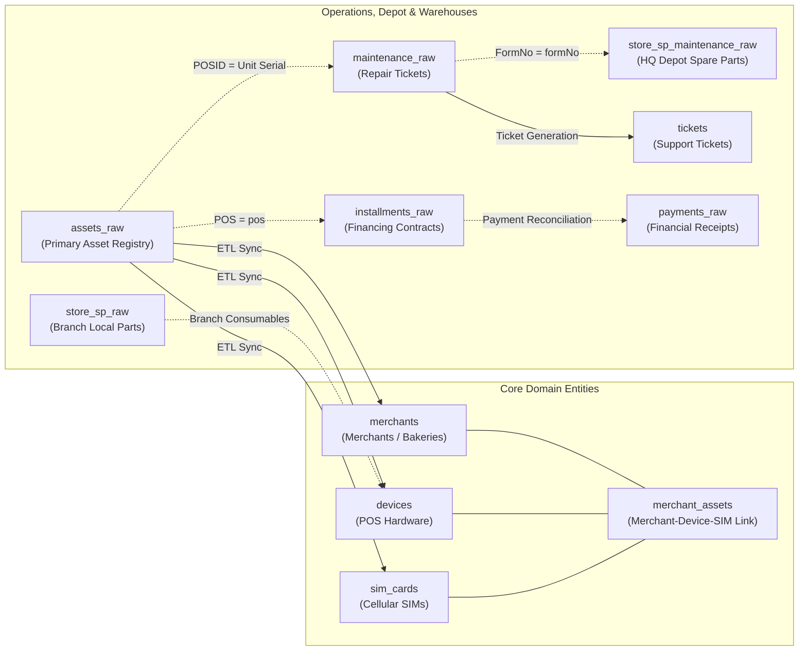

# SmartCS System Database Architecture & Comprehensive Schema Guide 📚

The **SmartCS** enterprise system utilizes a hybrid, high-performance database architecture designed to bridge live Access database synchronization (`Bread_Final_be.accdb`) with high-speed normalized domain entities powering the Web Dashboard, REST APIs, and the AI Copilot (Text-to-SQL engine).

---

## 🏛️ Architectural Layers

1. **Access Raw Replicas Layer (`_raw` Tables)**:
   - Direct real-time mirrors of legacy Microsoft Access tables.
   - Synchronized seamlessly via `sync_engine.js` whenever changes occur in the Access database.
   - Serve as the ground-truth source for historical repairs, warehouse logs, assets, and receipts.

2. **Normalized Domain Entities Layer**:
   - Structured, indexed entities maintained automatically via `syncHighLevelDomainEntities`.
   - Establishes clean relational mapping between: Merchants (`merchants`), Devices (`devices`), SIM cards (`sim_cards`), and their active links (`merchant_assets`).
   - Powers ticketing (`tickets`), inventory health, and installment tracking.

3. **Sync, Telemetry & Audit Layer**:
   - Sub-second audit logs capturing record-level diffs (`audit_change_logs`).
   - Outbox queuing mechanism for resilient cloud delta replication (`delta_outbox`).
   - Operational error logging and health telemetry (`system_error_logs`, `sync_history`).

---

## 📊 Detailed Table Directory

### 1. Access Raw Replicas (`_raw` Tables)

| Table Name | Description & System Role | Key Columns | UI Dashboard Usage | Cross-Table Join Relationships |
|---|---|---|---|---|
| **`assets_raw`** | Central asset registry of all bakery POS terminals, merchants, governorates, and supply offices (>4,200 records). | `ID` (Global ID)<br>`POS` (Terminal / Bakery Code)<br>`POSID` (Hardware Serial)<br>`Model` (Hardware Model)<br>`GrocerNumber` (Merchant ID)<br>`Contact_person` (Bakery Owner)<br>`Address` (Governorate / Area)<br>`Cell_Serial` (Installed SIM Serial) | • Global Search & Directory.<br>• Geographical distribution reports.<br>• Merchant Profile Card.<br>• AI Text-to-SQL query resolution. | • Joins with `maintenance_raw` on hardware serial (`assets_raw.POSID` = `maintenance_raw."Unit Serial"`).<br>• Joins with `transactions_raw` on (`assets_raw.POS` = `transactions_raw.POSN`).<br>• Joins with `payments_raw` on (`assets_raw.POS` = `payments_raw.pos_number`).<br>• Joins with `store_sim_raw` on (`assets_raw.Cell_Serial` = `store_sim_raw.sim_serial`).<br>• Joins with `installments_raw` on (`assets_raw.POS` = `installments_raw.pos`). |
| **`maintenance_raw`** | Maintenance ticket records, depot check-ins/check-outs, reported faults, and technician assignments. | `ID` (Record ID)<br>`Unit Serial` (Device Serial)<br>`Model` (Machine Model)<br>`Checked Out To` (Technician Name)<br>`Checked Out Date` (Depot dispatch)<br>`Checked In Date` (Return/repair date)<br>`Notes` (Primary Fault Description)<br>`Procedure` (Action / Technician)<br>`FormNo` (Official Form Number)<br>`spstatus` (Parts Approval Status) | • Maintenance Overview Dashboard.<br>• Top frequent faults analytics.<br>• Technician productivity tracking.<br>• Pending/Under-repair monitoring. | • Joins with `assets_raw` on (`"Unit Serial"` = `POSID`).<br>• Joins with `store_sp_maintenance_raw` on Form Number (`FormNo` = `formNo`).<br>• Joins with `tblstaff_raw` on technician name (`"Checked Out To"` = `name`).<br>• Joins with `tblfaults_raw` on fault taxonomy. |
| **`store_sp_raw`** | **Local Branch Spare Parts Warehouse** (records inward deliveries and outward local branch repair consumptions). | `Serial` (Part/device serial)<br>`type` (Part type: screen, printer, motherboard)<br>`Model` (Compatible model)<br>`count_in` (Received quantities)<br>`count_out` (Dispatched in branch)<br>`in_date`, `out_date` (Movement timestamps) | • Branch Spare Parts Inventory Tab.<br>• Daily and monthly branch parts consumption.<br>• Stock level thresholds. | • Represents the local branch side of parts.<br>• Joins with `failure_points_raw` on (`type` = `type`) for part pricing. |
| **`store_sp_maintenance_raw`** | **Central HQ Maintenance Center Spare Parts** (parts dispatched for major repairs under official maintenance Form Numbers). | `Serial` (Machine/part serial)<br>`type` (Part name: Motherboard, Card Reader, Gears, Battery)<br>`count_out` (Dispatched quantity)<br>`out_date` (Dispatch timestamp)<br>`formNo` (Maintenance Form Number)<br>`faulty_detils` (Fault details & model) | • HQ Maintenance Dashboard.<br>• Central repairs parts consumption.<br>• Reconciliation of maintenance forms with spare parts. | • Strictly joins with `maintenance_raw` on Form Number (`formNo` = `FormNo`) and serial (`Serial` = `"Unit Serial"`).<br>• Joins with `failure_points_raw` for pricing. |
| **`payments_raw`** | Financial receipts, bank transfers, post office deposits, and cashier collections. | `ID` (Receipt ID)<br>`payment_amount` (Amount in EGP)<br>`payment_date` (Deposit date)<br>`payer` (Payer / Merchant name)<br>`payment_reason` (Reason: Maintenance, Installment, SIM...)<br>`ref_num` (Bank / Post deposit slip number)<br>`pos_number` (POS Terminal Code)<br>`payment_place` (Deposit channel) | • Financial Audit & Payments Tab.<br>• Maintenance payment reconciliation.<br>• Installments settlement verification.<br>• Post Office deposit reports. | • Joins with `assets_raw` on (`pos_number` = `POS`).<br>• Joins with `installments_raw` to match installment payments.<br>• Joins with `tickets` on receipt reference (`ref_num`). |
| **`installments_raw`** / **`tblinstallments`** | Machine installment financing contracts, term counts, monthly amounts, and total contract value. | `id` (Contract ID)<br>`pos` (Terminal / Bakery ID)<br>`installments` (Total installment count)<br>`unitprice` (Base unit price)<br>`monthlyinstallmentprice` (Monthly due)<br>`finalunitprice` (Total financing price) | • Installments Dashboard.<br>• Outstanding debt and delinquent account tracking.<br>• Contract completion monitoring. | • Joins with `assets_raw` on terminal code (`pos` = `POS`).<br>• Joins with `payments_raw` to calculate paid installments where `payment_reason LIKE '%قسط%'`. |
| **`store_pos_raw`** | Physical warehouse inventory of POS machines in the branch (ready, reserved, faulty, scrap). | `Serial` (Device Serial)<br>`type` (Manufacturer: PAX, Verifone...)<br>`Model` (Model: S90, D230, VX520...)<br>`faulty` (Faulty flag)<br>`pos_status` (Stock Status: Available, Scrap, Maintenance...) | • Warehouse POS Inventory Tab.<br>• Ready-to-deploy buffer count.<br>• Defective machines quarantine. | • Joins with `assets_raw` on (`Serial` = `POSID`).<br>• Joins with `temp_transfer_raw` when dispatching replacement terminals. |
| **`store_sim_raw`** | Branch SIM cards inventory by telecom carrier (Vodafone, Orange, Etisalat, WE). | `sim_serial` (SIM Serial Number)<br>`network` (Telecom Carrier)<br>`sim_type` (Card Format/Type)<br>`faulty` (Operational status) | • SIM Cards Warehouse Tab.<br>• Available carrier quotas.<br>• Faulty/deactivated cards logging. | • Joins with `assets_raw` on SIM serial (`sim_serial` = `Cell_Serial`).<br>• Joins with `merchants` upon SIM assignment. |
| **`transactions_raw`** | Field operations and administrative transactions (replacements, installations, withdrawals, audits). | `ID` (Tx ID)<br>`GrocerName` (Merchant / Bakery Name)<br>`POSN` (Terminal Code)<br>`Place` (Governorate / Directorate)<br>`ActionType` (Action: Replace, Install, Withdraw, Check)<br>`ActionDate` (Execution Date)<br>`FeesAmount` (Fee in EGP)<br>`Procedure` (Operating officer) | • Merchant operations timeline.<br>• Field audit verification.<br>• Fees & settlements tracking. | • Joins with `assets_raw` on (`POSN` = `POS`).<br>• Joins with `tblstaff_raw` on officer name (`Procedure`). |
| **`temp_transfer_raw`** / **`temp_transfer`** | Temporary replacement machine movements while merchant's primary machine is in repair depot. | `POSCode` (Terminal Code)<br>`OldPOS` (Defective Serial checked in)<br>`NewPOS` (Loaner Serial dispatched)<br>`Transfer_Date` (Swap Date)<br>`bkCode` (Bakery ID) | • Tracking loaner devices in the field.<br>• Preventing terminal shrinkage during depot repairs. | • Joins with `assets_raw` and `store_pos_raw` on old/new serials (`OldPOS`, `NewPOS`).<br>• Joins with `merchants` on `bkCode`. |
| **`failure_points_raw`** | Official standard price list for spare parts, maintenance fees, and repairs per device model. | `type` (Part Name)<br>`model` (Compatible POS Model)<br>`fees` (Labor/Maintenance fee)<br>`price` (Selling price in EGP) | • Automated maintenance invoicing.<br>• Expected revenue computation. | • Joins with `store_sp_raw` and `store_sp_maintenance_raw` on (`type` + `model`). |
| **`failure_points_price_history`** | Historical audit trail of spare part price adjustments and effective dates. | `part_name`, `model`, `old_price`, `new_price`, `change_date`, `effective_from`, `change_source` | • Price revision audit trail.<br>• Inflation / cost tracking. | • Joins with `failure_points_raw` on (`part_name` = `type`). |
| **`tblfaults_raw`** / **`tblfaults`** | Standard dictionary of classified machine faults (Screen, Printer, Reader, Board...). | `faultid` / `id` (Fault ID)<br>`FaultName` / `fault_name` (Arabic description) | • Standardized dropdown options in tickets.<br>• Directs AI model on fault classification. | • Joins with `tblfixes_raw` on (`faultid` = `FaultID`).<br>• Correlates with `maintenance_raw.Notes`. |
| **`tblfixes_raw`** | Recommended technical actions and resolution guides per fault category. | `FixID` (Fix identifier)<br>`FaultID` (Associated Fault ID)<br>`FixName` (Action: Replace Board, Clean Gears, Solder...) | • Guides technicians on approved repair procedures.<br>• Standardized ticket resolution descriptions. | • Joins with `tblfaults_raw` on (`FaultID` = `faultid`). |
| **`tblstaff_raw`** / **`tblstaff`** | Directory of company employees, repair technicians, job titles, and permissions. | `id` (Staff ID)<br>`name` (Employee Name)<br>`jtitle` / `role` (Job Title)<br>`can_maintain` (Maintenance certification flag) | • User authentication and role-based access.<br>• Ticket dispatching to technicians.<br>• Individual repair efficiency metrics. | • Joins with `maintenance_raw` on (`name` = `Checked Out To` or `Procedure`).<br>• Joins with `tickets` on `technician_name`. |
| **`trade_raw`** | General hardware inter-branch transit and logistics dispatch ledger. | `ID`, `Item Serial`, `Item Type`, `Trade Type`, `Trade Location`, `Out Date`, `In Date`, `Quantity`, `Form Number` | • Cross-branch asset logistics and transfer logs. | • Joins with warehouses on (`Item Serial`, `Form Number`). |

---

### 2. Normalized Domain Entities Layer

| Table Name | Description & Role | Key Columns | Primary Relationships |
|---|---|---|---|
| **`merchants`** | Canonical bakery owner / merchant entity. | `merchant_code` (PK)<br>`name`, `type`, `contact_phone`, `address`, `government`, `national_id` | Master root entity linked to `merchant_assets`, `tickets`, and `payments`. |
| **`devices`** | Canonical POS hardware entity including physical and electrical repair status. | `serial` (PK)<br>`manufacturer`, `model`, `status`, `faulty_details`, `solder_bridges` | Linked to merchants via `merchant_assets` and to repairs via `tickets.device_id`. |
| **`sim_cards`** | Canonical cellular SIM entity. | `serial` (PK)<br>`carrier`, `status` | Linked to merchants and devices via `merchant_assets`. |
| **`merchant_assets`** | **Central Tripartite Association Table** (Merchant ↔ Terminal ↔ SIM card). | `id`, `merchant_code`, `device_id`, `sim_card_id`, `assigned_date` | Joins (`merchants.merchant_code`), (`devices.serial`), and (`sim_cards.serial`). |
| **`tickets`** | Operational customer support and repair ticketing table. | `id`, `merchant_code`, `device_id`, `status`, `issue_details`, `technician_name`, `issue_date`, `close_date`, `hq_debt` | Associates merchant, defective terminal, repair technician, and outstanding fees. |
| **`spare_parts`** | Aggregated spare parts catalog with critical low-stock alerting limits. | `id`, `part_name`, `compatible_models`, `critical_limit`, `price`, `quantity_in_stock` | Drives inventory depletion alerts based on dispatch logs. |
| **`tblspare_part_logs`** | Granular ledger of specific parts consumed inside each repair ticket. | `id`, `ticket_id`, `part_id`, `quantity`, `price`, `is_free`, `receipt_num` | Connects tickets to inventory deductions, auditing free vs. paid parts. |

---

### 3. Sync, Telemetry & Audit Layer

| Table Name | Description & Role |
|---|---|
| **`sync_history`** | Comprehensive telemetry recording each sync cycle (duration in ms, sync type: `LOCAL_ACCESS` vs `CLOUD_VPS`, processed row counts, and status). |
| **`audit_change_logs`** | Immutable audit black box: logs every row INSERT, UPDATE, or DELETE with exact before/after JSON payloads (`old_data` vs `new_data`). |
| **`delta_outbox`** / **`dlq`** | Resilient persistent queue storing pending deltas for Oracle Cloud VPS replication during network outages with exponential backoff. |
| **`system_error_logs`** | Real-time system exception log capturing SQL errors, route crashes, and client IP addresses for proactive debugging. |

---

## 🔗 Visual Relationship Flowchart (Mermaid)



---

## 💡 Key SQL Cross-Table Join Patterns for AI & Developers

1. **Asset with Depot Repair History**:
   ```sql
   SELECT a.POS, a.GrocerNumber, a.Contact_person, m.Notes, m."Checked In Date"
   FROM assets_raw a
   JOIN maintenance_raw m ON a.POSID = m."Unit Serial";
   ```

2. **Maintenance Record with Dispatched HQ Spare Parts**:
   ```sql
   SELECT m."Unit Serial", m.Model, m.Notes, sp.type AS part_used, sp.count_out, sp.out_date
   FROM maintenance_raw m
   JOIN store_sp_maintenance_raw sp ON m.FormNo = sp.formNo;
   ```

3. **Installment Contract with Matching Payments**:
   ```sql
   SELECT i.pos, i.monthlyinstallmentprice, i.finalunitprice, p.payment_amount, p.payment_date, p.ref_num
   FROM installments_raw i
   JOIN payments_raw p ON i.pos = p.pos_number
   WHERE p.payment_reason LIKE '%قسط%';
   ```
